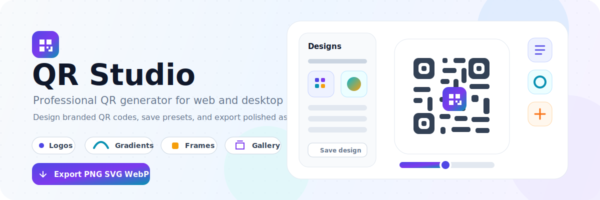

<p align="center">
  
</p>

# QR Studio

Professional QR code generator built with React + TypeScript and a Go/Wails backend. Runs as a browser-based web app **or** as a native desktop application on Windows, macOS, and Linux.

## Highlights

- Generate QR codes for URLs, text, email, Wi-Fi, vCard contacts, calendar events, and map locations.
- Customize dot styles, corner styles, frames, gradients, transparent backgrounds, logos, and background images.
- Save reusable Designs, import/export design JSON, and start from built-in professional presets.
- Export PNG, SVG, JPEG, or WebP, export multiple sizes at once, customize filenames, copy to clipboard, share, print, and save QR codes to the in-app gallery.
- Use the same React UI in web mode and Wails desktop mode with a storage abstraction for browser `localStorage` or desktop SQLite.

---

## 🚀 Quick Start

### Prerequisites

**Web mode only:**
- Node.js 18+ and npm

**Desktop mode (all platforms):**
- Go 1.25+
- Node.js 18+ and npm
- Wails CLI v2.11+
  ```
  go install github.com/wailsapp/wails/v2/cmd/wails@latest
  ```

### Web Development

```powershell
cd frontend
npm install
npm run dev     # Vite dev server at http://localhost:3000
```

### Desktop Development

```powershell
# Full hot-reload (Wails manages the Vite dev server automatically)
wails dev

# Or: start Vite and the Go backend separately
cd frontend; npm run dev                                       # Terminal 1 — Vite at :3000
.\scripts\dev-backend.ps1 -ViteUrl http://localhost:3000       # Terminal 2 — Go backend
```

### Production Builds

**Desktop:**
```powershell
.\scripts\build-wails-windows.ps1                          # Windows x64
.\scripts\build-wails-windows.ps1 -Architecture arm64     # Windows ARM64
.\scripts\build-wails-windows.ps1 -Architecture all       # Both Windows arches

.\scripts\build-wails-macos.ps1                            # macOS Universal (Intel + Apple Silicon)
.\scripts\build-wails-macos.ps1 -Architecture arm64       # Apple Silicon only
.\scripts\build-wails-macos.ps1 -Architecture amd64       # Intel only

.\scripts\build-wails-linux.ps1                            # Linux x64
.\scripts\build-wails-linux.ps1 -Architecture arm64       # Linux ARM64
.\scripts\build-wails-linux.ps1 -Architecture all         # Both Linux arches
```

All desktop scripts accept `-Clean` and `-SkipDeps` flags.

**Web:**
```powershell
.\scripts\build-web.ps1           # Build static site → frontend/dist/
.\scripts\build-web.ps1 -Clean   # Clean dist first, then build
```

---

## 📁 Project Structure

```
QR-Studio-Go/
├── backend/                  # Go backend
│   ├── app.go                # Wails App struct + lifecycle hooks
│   ├── database/
│   │   ├── db.go             # SQLite connection manager (WAL mode)
│   │   ├── migrations.go     # Schema migrations
│   │   └── models.go         # Template, Setting, HistoryEntry structs
│   └── services/
│       ├── templates.go      # Template CRUD
│       ├── settings.go       # User settings persistence
│       ├── export.go         # File export + native dialogs
│       └── history.go        # Export history tracking
├── frontend/                 # React + TypeScript frontend
│   ├── App.tsx               # Root component, global QRSettings state
│   ├── index.tsx             # Entry point
│   ├── types.ts              # QRSettings, DotType, FrameStyle, etc.
│   ├── components/
│   │   ├── QRControls.tsx    # Content, design, colors, logo, and Designs controls
│   │   ├── QRPreview.tsx     # Live preview, export, copy, share, print, gallery save
│   │   ├── SettingsPanel.tsx # User preferences slide-over
│   │   └── ui/               # Button, Input, Slider, ColorPicker, Tabs, Toast
│   ├── contexts/
│   │   ├── SettingsContext.tsx
│   │   └── ToastContext.tsx
│   ├── hooks/
│   │   ├── useKeyboardShortcuts.ts
│   │   └── useWindowState.ts
│   ├── services/
│   │   ├── storage.ts        # IStorageService interface + factory
│   │   ├── localStorage.ts   # Web localStorage implementation
│   │   ├── wailsStorage.ts   # Desktop SQLite via Wails bindings
│   │   ├── migration.ts      # localStorage → SQLite migration
│   │   ├── fileExport.ts     # Native dialogs + file operations
│   │   └── version.ts        # Semantic versioning + compat checks
│   └── wailsjs/              # Wails-generated TypeScript bindings
├── scripts/                  # Build and dev scripts
│   ├── build-wails-windows.ps1
│   ├── build-wails-macos.ps1
│   ├── build-wails-linux.ps1
│   ├── build-web.ps1
│   ├── dev-backend.ps1       # Start backend only (use with external Vite)
│   └── build.ps1             # Legacy Windows build script
├── build/                    # Build output (generated)
│   └── bin/                  # Compiled executables
├── docs_internal/            # Internal roadmap documentation
│   └── ROADMAP.md
├── doc_internal/             # Internal review reports
│   └── playwright_visual_review_2026-05-06.md
├── main.go                   # Wails entry point
├── go.mod                    # Go module (go 1.25, wails v2.11)
└── wails.json                # Wails configuration
```

---

## 🔧 Dual-Mode Architecture

QR Studio shares the same React frontend across both modes — the storage layer and file-export layer adapt automatically.

### Web Mode (Browser)
- Storage: `localStorage`
- File export: Browser download API
- Limitation: ~5–10 MB storage quota, no native file dialogs

### Desktop Mode (Wails)
- Storage: SQLite at `%APPDATA%\QRStudio\qr-studio.db` (Windows) / OS-equivalent path
- File export: Native OS dialogs
- Extras: Unlimited storage, keyboard shortcuts, window state persistence

### Storage Abstraction

Always access storage through the factory — never touch `localStorage` or Wails IPC directly in components:

```typescript
import { getStorageService } from './services';
import { SETTING_KEYS } from './services';

const storage = getStorageService();
const templates = await storage.getTemplates();
await storage.saveTemplate({ ...settings, id: `tpl_${Date.now()}`, name: 'My Design' });
await storage.setSetting(SETTING_KEYS.THEME, 'dark');
const theme = await storage.getSetting(SETTING_KEYS.THEME);
```

### First-Run Migration (Desktop)

On the first desktop launch, any templates saved in `localStorage` are automatically migrated to SQLite:

```typescript
import { initMigration } from './services';

// Called once in App.tsx on mount
const result = await initMigration();
```

---

## QR Content Types

| Type | Fields |
|------|--------|
| URL / Text / Email | Free-form text |
| Wi-Fi | SSID, password, encryption (WEP/WPA/none), hidden |
| vCard | Name, phone, mobile, email, website, company, job title, address |
| Calendar Event | Title, location, description, start/end time |
| Location | Latitude, longitude |

---

## ⌨️ Keyboard Shortcuts

| Shortcut | Action |
|----------|--------|
| `Ctrl+,` | Open settings |
| `Escape` | Close dialogs |
| `Ctrl+Z` | Undo the last QR setting change |
| `Ctrl+Shift+Z` | Redo the last undone QR setting change |
| `Ctrl+Shift+S` | Save the current QR code to the gallery |

---

## 🗄️ Database (Desktop)

SQLite database — tables:

| Table | Purpose |
|-------|---------|
| `templates` | Saved QR designs (id, name, settings JSON, logo/background BLOBs) |
| `settings` | Key-value user preferences |
| `history` | Export history with timestamps |
| `schema_version` | Schema version tracking |

---

## ⚙️ Configuration

**wails.json** key settings:
```json
{
  "frontend:build": "npm run build:wails",
  "outputfilename": "QRStudio",
  "info": {
    "productName": "QR Studio",
    "productVersion": "1.0.0"
  }
}
```

User settings stored in the database (desktop) or `localStorage` (web):

| Key | Values | Default |
|-----|--------|---------|
| `theme` | `light`, `dark`, `system` | `system` |
| `default_export_format` | `png`, `svg`, `jpeg`, `webp` | `png` |
| `default_qr_size` | 100–4000 | `1000` |
| `default_error_correction` | `L`, `M`, `Q`, `H` | `M` |
| `show_history` | `true`, `false` | `true` |
| `auto_save_templates` | `true`, `false` | `false` |

---

## ⚠️ Known Limitations

- Web mode storage capped at ~5–10 MB (browser `localStorage` quota)
- Clipboard copy and native share can fail in insecure or unsupported browser contexts
- The web frontend currently uses the Tailwind CDN in `index.html`; migrate to a local Tailwind/PostCSS build before hardening a public production deployment
- Cross-platform desktop builds require the target platform's packaging toolchain and Wails dependencies

---

## 📚 Internal Documentation

- [docs_internal/ROADMAP.md](docs_internal/ROADMAP.md) — planned features and backlog
- [doc_internal/playwright_visual_review_2026-05-06.md](doc_internal/playwright_visual_review_2026-05-06.md) — latest visual review findings and fixes

---

## Contributing

1. Create feature branches and open PRs against `main`
2. Test in both web mode (`npm run dev`) and desktop mode (`wails dev`)
3. Use the storage abstraction — never access `localStorage` or Wails IPC directly from components
4. Update `docs_internal/ROADMAP.md` or add a `doc_internal/` report for significant architecture, UX, or testing changes
