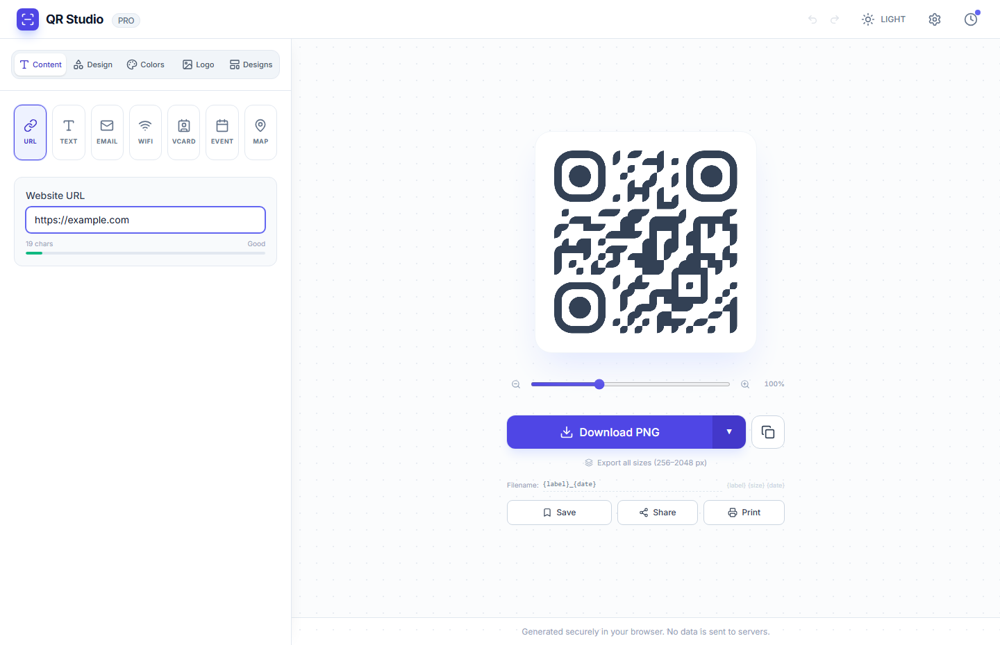
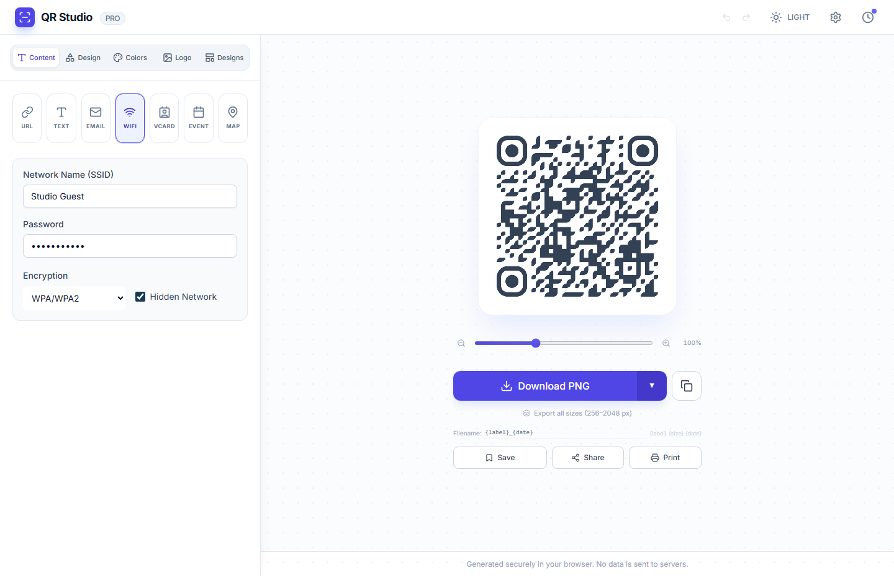
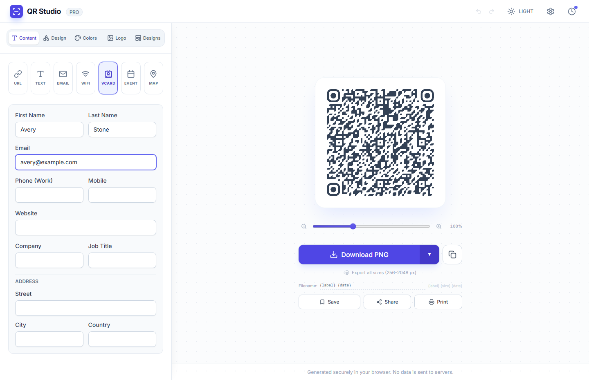
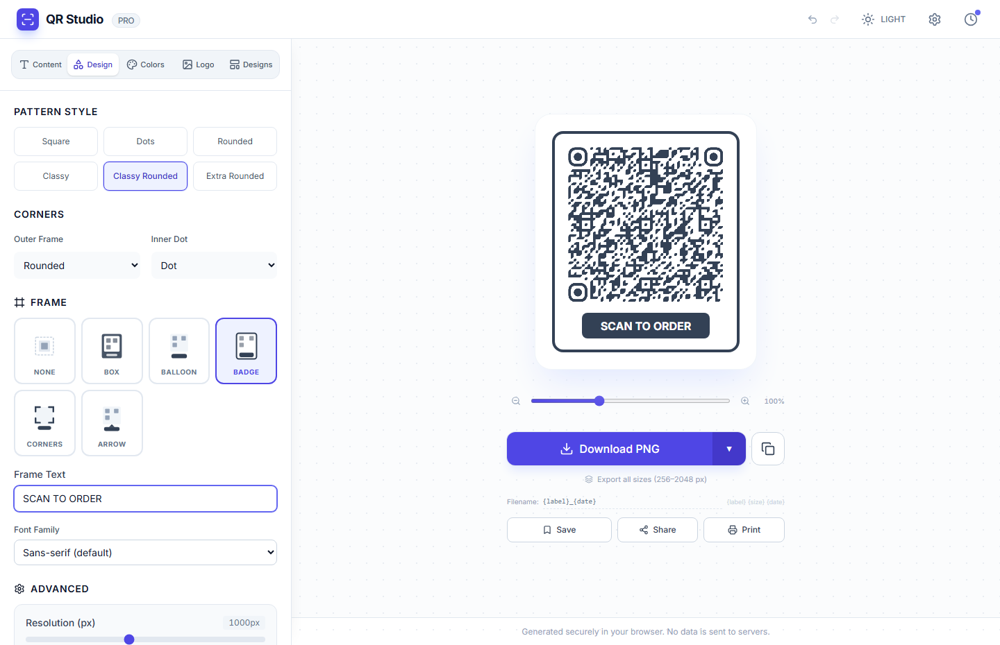
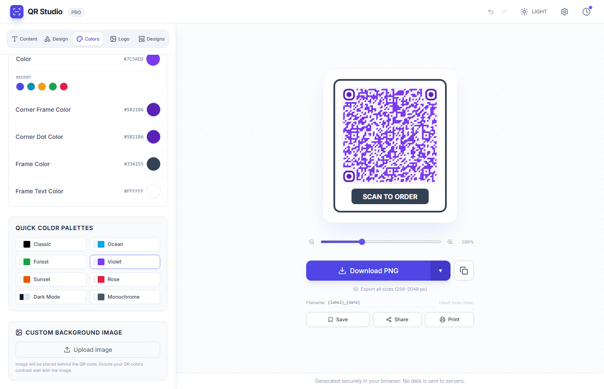
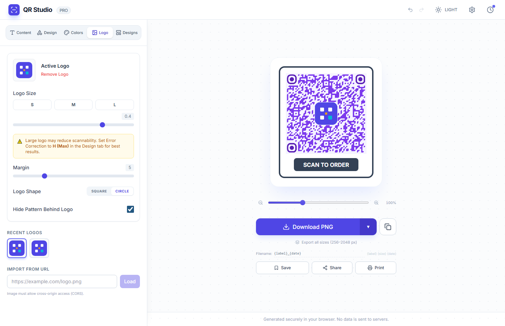
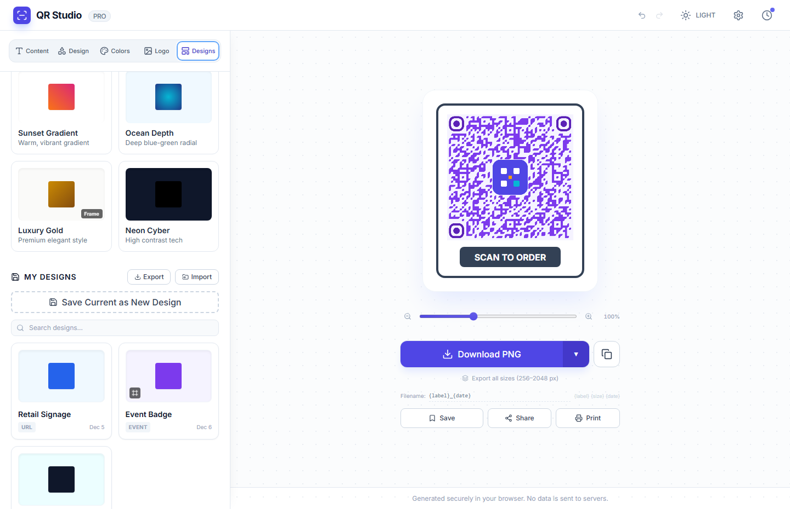
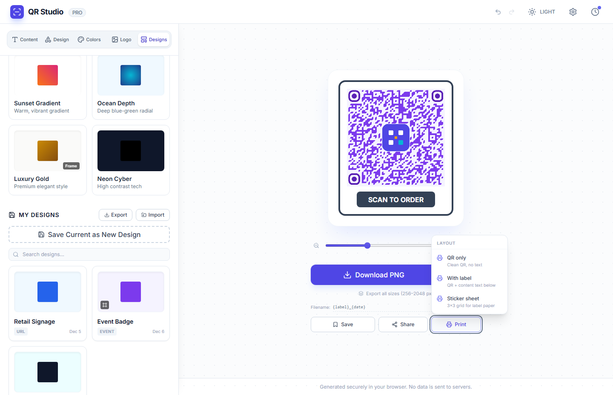
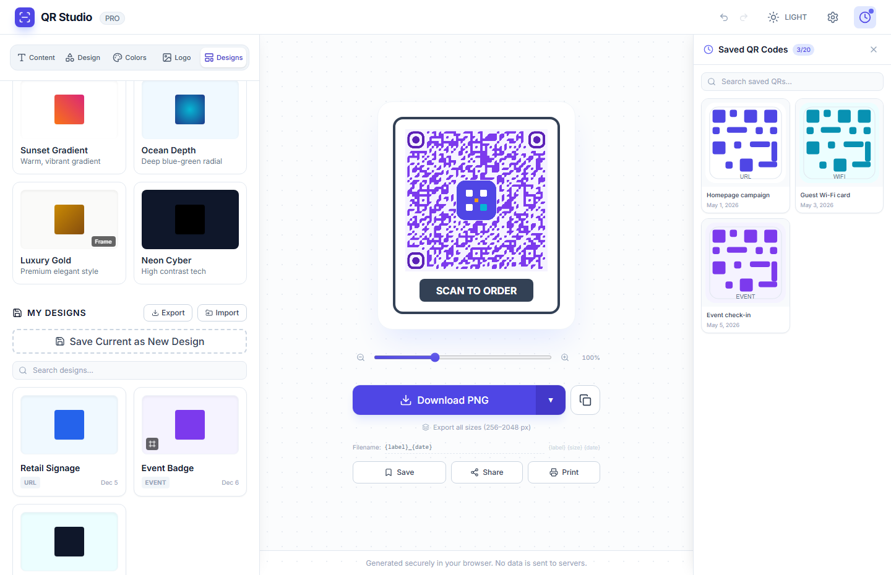
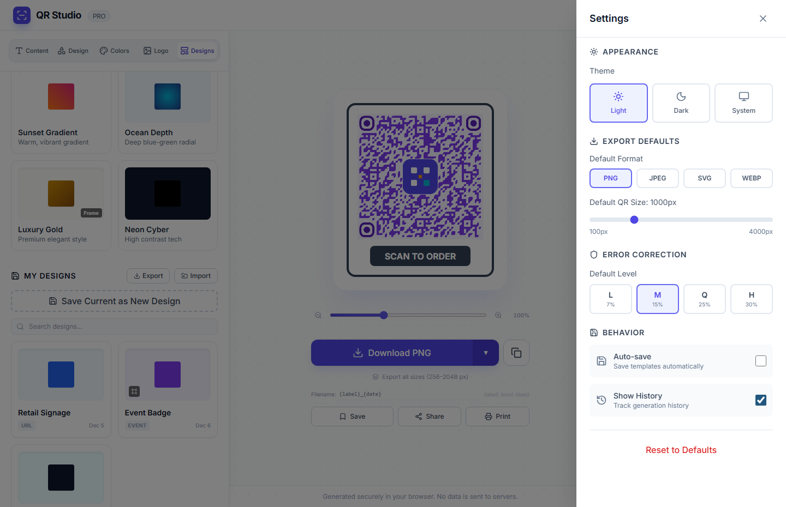

# QR Studio Documentation

Last updated: May 6, 2026

QR Studio is a professional QR code generator for web and desktop. It uses a shared React and TypeScript frontend, runs in browser mode through Vite, and can be packaged as a native desktop application with Go and Wails.

The screenshots in this document were captured with Playwright from `http://localhost:3000/` using a fresh browser context with seeded example designs and saved QR codes. The screenshot assets live in `assets/screenshots`.

## Table of Contents

- [Overview](#overview)
- [Application Tour](#application-tour)
- [Content Types](#content-types)
- [Design Controls](#design-controls)
- [Color and Background Controls](#color-and-background-controls)
- [Logo Controls](#logo-controls)
- [Design Library](#design-library)
- [Preview, Export, Share, and Print](#preview-export-share-and-print)
- [Saved QR Gallery](#saved-qr-gallery)
- [Settings](#settings)
- [Keyboard Shortcuts](#keyboard-shortcuts)
- [Architecture](#architecture)
- [Development](#development)
- [Builds](#builds)
- [Storage](#storage)
- [Troubleshooting](#troubleshooting)

## Overview

QR Studio helps users create production-ready QR codes with content, visual styling, export, and persistence tools in one workspace.

Core capabilities:

- Generate QR codes for URL, text, email, Wi-Fi, vCard contact cards, calendar events, and map locations.
- Customize pattern style, corner style, quiet zone, error correction, frame style, frame text, and export resolution.
- Use solid colors, gradients, transparent backgrounds, color palettes, and background images.
- Add centered logos from file upload, drag and drop, previous logo history, or URL import.
- Save reusable designs, start from professional presets, and import or export designs as JSON.
- Export QR codes as PNG, SVG, JPEG, or WebP.
- Export multiple PNG sizes at once.
- Copy, share, print, save to the in-app gallery, rename saved gallery items, and download saved QR thumbnails.
- Run as a web application or as a native desktop application backed by SQLite.

## Application Tour

The main workspace is split into three areas:

- Header: app identity, undo and redo, theme switcher, settings, desktop maximize when available, and saved QR drawer.
- Left controls panel: content, design, colors, logo, and designs tabs.
- Preview workspace: live QR preview, zoom control, export actions, filename template, share, print, and save actions.



The preview updates as settings change. The footer notes that generation happens locally in the browser and data is not sent to a server.

## Content Types

The Content tab controls the payload embedded in the QR code. QR Studio keeps type-specific form state and regenerates the final QR data string whenever a content field changes.

Supported content types:

| Type | Payload format | Main fields |
| --- | --- | --- |
| URL | Plain URL text | Website URL |
| Text | Plain text | Free-form content |
| Email | Plain email text | Email address |
| Wi-Fi | `WIFI:S:<ssid>;T:<encryption>;P:<password>;H:<hidden>;;` | SSID, password, encryption, hidden network |
| vCard | `BEGIN:VCARD` version 3.0 | Name, email, phone, mobile, website, company, title, address |
| Event | `BEGIN:VCALENDAR` with `VEVENT` | Title, start/end time, location, description |
| Map | `geo:<latitude>,<longitude>` | Latitude, longitude |

The URL, text, and email modes include a character count and density indicator. URL and email modes also show validation hints for common malformed values.



The vCard mode provides structured contact fields and an address section.



## Design Controls

The Design tab controls QR structure and frame presentation.

Pattern styles:

- Square
- Dots
- Rounded
- Classy
- Classy rounded
- Extra rounded

Corner controls:

- Outer frame: square, dot, rounded
- Inner dot: square, dot

Frame styles:

- None
- Box
- Balloon
- Badge
- Corners
- Arrow

When a frame is active, users can edit the frame text and font family. The available font families are sans-serif default, serif, monospace, Impact, and Trebuchet.

Advanced controls:

- Resolution from 256 px to 2048 px
- Quiet zone from 0 to 50
- Error correction level: L, M, Q, H



Use higher error correction when adding a large logo or aggressive visual styling. The Logo tab also warns when the logo is large and error correction is below `H`.

## Color and Background Controls

The Colors tab controls visual color treatment for background, QR pattern, corners, and frames.

Available color features:

- Solid color or gradient for background and QR pattern.
- Linear or radial gradients.
- Linear gradient rotation from 0 to 360 degrees.
- Start and end gradient color stops.
- Transparent background toggle for PNG and WebP exports.
- Separate corner frame and corner dot colors.
- Frame color and frame text color when a frame is enabled.
- Recent color swatches.
- Quick palettes: Classic, Ocean, Forest, Violet, Sunset, Rose, Dark Mode, and Monochrome.
- Custom background image upload.



When using background images, choose QR and corner colors with strong contrast. Low-contrast backgrounds can reduce scan reliability.

## Logo Controls

The Logo tab adds a centered logo to the QR code.

Logo import methods:

- Click upload area.
- Drag and drop an image.
- Upload PNG, JPG, or SVG.
- Reuse recent logos from logo history.
- Import an image by URL when the remote image allows cross-origin access.

Logo options:

- Size presets: S, M, L.
- Fine-grained logo size slider.
- Logo margin slider.
- Square or circle logo shape.
- Hide pattern behind logo.



Scannability guidance:

- Keep logos modest in size.
- Prefer high error correction (`H`) for large logos.
- Keep enough margin around the logo.
- Test the exported QR code with multiple scanners before printing.

## Design Library

The Designs tab combines built-in professional presets with user-saved designs.

Professional presets:

- Classic Black
- Modern Blue
- Sunset Gradient
- Ocean Depth
- Luxury Gold
- Neon Cyber

User design actions:

- Save current settings as a new design.
- Search saved designs.
- Load a design while keeping current content.
- Rename saved designs.
- Duplicate designs.
- Delete designs.
- Export all saved designs as JSON.
- Import designs from JSON.



Saved designs preserve styling settings, logos, background images, and frame options. Loading a design intentionally keeps the current QR content so a user can reuse the same visual treatment for a new URL, Wi-Fi card, event, or contact.

## Preview, Export, Share, and Print

The preview area renders the live QR code and provides output controls.

Preview controls:

- Zoom from 50 percent to 200 percent.
- Reset zoom to 100 percent.
- Live updating indicator while the QR code is refreshed.

Export controls:

- Download as PNG, SVG, JPEG, or WebP.
- Export all sizes as PNG: 256, 512, 1024, and 2048 px.
- Customize filenames with tokens.

Filename tokens:

| Token | Meaning |
| --- | --- |
| `{label}` | Sanitized QR content label |
| `{size}` | Export size in pixels |
| `{date}` | Current date |
| `{format}` | Export format |

Secondary actions:

- Copy QR image to clipboard.
- Save QR to gallery.
- Share QR image or URL where supported.
- Print QR only, QR with label, or a 3x3 sticker sheet.



Browser support notes:

- Clipboard image copy requires a secure and compatible browser context.
- Native file sharing depends on browser and operating system support.
- Print opens a separate print window; pop-up blockers can prevent it.

## Saved QR Gallery

The saved QR drawer stores generated QR thumbnails separately from reusable design templates.

Saved QR features:

- Open or close from the header history button.
- Save the current QR from the preview action bar.
- Store up to 20 saved QR codes.
- Search saved QR labels.
- Rename saved QR entries.
- Download saved QR thumbnails.
- Delete saved QR entries.



Saved QR entries are useful for short-term access to generated images. Use Designs for reusable styling and saved QR codes for finished generated outputs.

## Settings

The Settings panel is opened from the header settings button or `Ctrl+,`.

Settings sections:

- Appearance: light, dark, or system theme.
- Export defaults: default format and default QR size.
- Error correction: default L, M, Q, or H level.
- Behavior: auto-save and show-history preferences.
- Reset to defaults.



The panel includes a focus trap and closes with Escape or the close button.

## Keyboard Shortcuts

| Shortcut | Action |
| --- | --- |
| `Ctrl+,` | Open or close settings |
| `Escape` | Close dialogs and panels |
| `Ctrl+Z` | Undo QR setting changes |
| `Ctrl+Shift+Z` | Redo QR setting changes |
| `Ctrl+Shift+S` | Save the current QR code to the gallery |

Undo and redo are debounced around setting changes so slider movement and rapid control changes are grouped into usable history entries.

## Architecture

QR Studio uses one frontend across web and desktop modes.

Main directories:

| Path | Purpose |
| --- | --- |
| `frontend/` | React, TypeScript, Vite UI |
| `frontend/components/QRControls.tsx` | Content, design, color, logo, and design library controls |
| `frontend/components/QRPreview.tsx` | Live preview, export, copy, share, print, save, zoom |
| `frontend/components/SettingsPanel.tsx` | Settings slide-over panel |
| `frontend/contexts/SettingsContext.tsx` | Persistent user preferences |
| `frontend/contexts/ToastContext.tsx` | Toast notifications |
| `frontend/services/storage.ts` | Storage interface and constants |
| `frontend/services/localStorage.ts` | Browser storage implementation |
| `frontend/services/wailsStorage.ts` | Wails desktop storage implementation |
| `backend/` | Go backend for desktop mode |
| `backend/database/` | SQLite connection, migrations, models |
| `backend/services/` | Template, settings, history, and export services |
| `scripts/` | Build and development scripts |

Runtime mode differences:

| Feature | Web mode | Desktop mode |
| --- | --- | --- |
| UI | React/Vite | Same React UI embedded in Wails |
| Storage | Browser `localStorage` | SQLite |
| File export | Browser download APIs | Native Wails/OS dialogs where available |
| Data limits | Browser quota, often around 5-10 MB | Database-backed storage |
| Desktop controls | Not available | Native window state and maximize controls |

The QR renderer is `qr-code-styling`. Icons are from `lucide-react`.

## Development

Prerequisites:

- Node.js 18 or newer
- npm
- Go 1.25 or newer for desktop/backend work
- Wails CLI v2.11 or newer for desktop builds

Install frontend dependencies:

```powershell
cd frontend
npm install
```

Run web development server:

```powershell
cd frontend
npm run dev
```

The Vite development server runs at:

```text
http://localhost:3000/
```

Run Wails desktop development:

```powershell
wails dev
```

Alternative split-mode development:

```powershell
cd frontend
npm run dev
```

```powershell
.\scripts\dev-backend.ps1 -ViteUrl http://localhost:3000
```

## Builds

Build web static assets:

```powershell
.\scripts\build-web.ps1
```

Build desktop applications:

```powershell
.\scripts\build-wails-windows.ps1
.\scripts\build-wails-macos.ps1
.\scripts\build-wails-linux.ps1
```

Desktop build scripts support options such as `-Clean`, `-SkipDeps`, and architecture arguments where implemented.

## Storage

QR Studio uses a storage abstraction so components do not call `localStorage` or Wails IPC directly.

Primary storage interface:

```typescript
const storage = getStorageService();
const templates = await storage.getTemplates();
await storage.saveTemplate(template);
await storage.setSetting('theme', 'dark');
```

Browser storage:

- Templates: `qr_studio_templates`
- Settings: `qr_studio_settings_<key>`
- Saved QR gallery: `qr_studio_settings_saved_qrs`
- Logo history: `qr_studio_settings_logo_history`
- Color history: `qr_studio_settings_color_history`

Desktop storage:

- SQLite database managed by the Go backend.
- Tables include `templates`, `settings`, `history`, and `schema_version`.
- First-run migration can move existing browser templates into SQLite in desktop mode.

Saved templates and saved QR codes are intentionally separate:

- Templates are reusable style and configuration presets.
- Saved QR codes are generated output thumbnails for quick retrieval.

## Troubleshooting

QR code looks too dense:

- Reduce content length.
- Use a lower-density payload where possible.
- Increase output size.
- Use error correction `Q` or `H` for styled QR codes.

Logo makes the QR hard to scan:

- Reduce logo size.
- Increase logo margin.
- Enable "Hide Pattern Behind Logo".
- Set error correction to `H`.
- Keep strong color contrast.

Transparent export does not look expected:

- Transparent background applies to PNG and WebP exports.
- View the exported image on a contrasting background to confirm transparency.

Clipboard copy fails:

- Use a secure browser context.
- Try downloading instead.
- Some browsers block image clipboard writes.

Share does not open the native share sheet:

- Browser and operating system support vary.
- Use copy image, copy URL, or download as fallback.

Print menu opens but nothing prints:

- Allow pop-ups for the local app.
- Use the browser print dialog from the opened print window.

Design JSON import fails:

- Confirm the file is a JSON array of QR Studio design objects.
- Remove duplicate IDs if imported entries do not appear.
- Check that embedded logo or background images are not too large for browser storage.

Desktop storage appears empty after moving from web mode:

- Desktop mode uses SQLite, not browser `localStorage`.
- First-run migration only runs when desktop mode detects eligible browser templates.
- Export designs to JSON from web mode and import them in desktop mode if automatic migration is not available.

## Screenshot Inventory

| File | Feature |
| --- | --- |
| `assets/screenshots/01-main-workspace.png` | Main workspace |
| `assets/screenshots/02-content-wifi.png` | Wi-Fi content form |
| `assets/screenshots/03-content-types-vcard.png` | vCard content form |
| `assets/screenshots/04-design-frame-controls.png` | Pattern, corner, frame, and advanced design controls |
| `assets/screenshots/05-color-gradient-palettes.png` | Colors, gradients, and quick palettes |
| `assets/screenshots/06-logo-controls.png` | Logo upload and logo styling controls |
| `assets/screenshots/07-designs-library.png` | Presets and saved design library |
| `assets/screenshots/08-export-print-menu.png` | Export and print actions |
| `assets/screenshots/09-saved-qr-gallery.png` | Saved QR gallery drawer |
| `assets/screenshots/10-settings-panel.png` | Settings panel |
